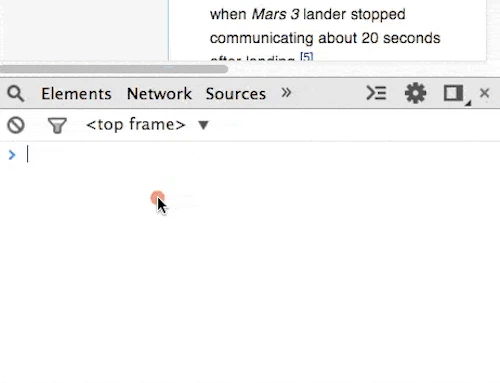

You can log all the events dispatched to an object using the Command Line API method. The event objects are then logged to the Console. Useful when you need a reminder of the available properties on the event object.

{: .mx-auto}

---

> JavaScript

Subscribe to all windows events:



```
    monitorEvents(window, "click")
```

---

Unsubscribe from all windows events:



```
    unmonitorEvents(window, "click")
```

---

source: [source](https://developer.chrome.com/docs/devtools/console/utilities/)
